<div align="center">

# 🔐 Digital Vault

### Secure • Modern • Responsive • Cloud-Based Document Management

<p align="center">
  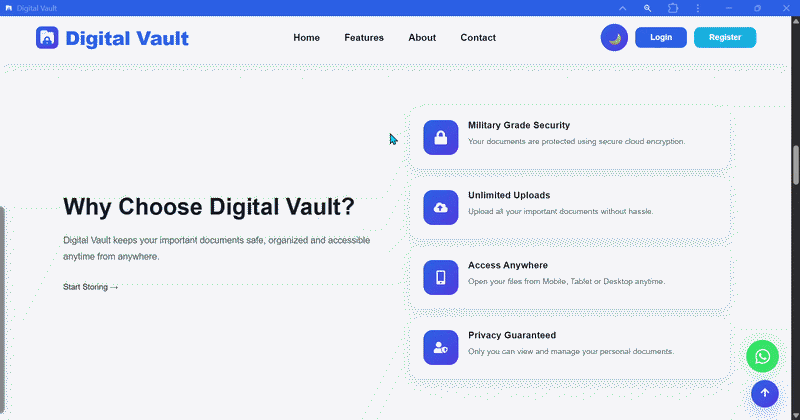
</p>

<p align="center">
  <a href="https://github.com/nitesh933438/Digital-Vault">
    
  </a>
  <a href="https://nitesh933438.github.io/Digital-Vault/">
    
  </a>
</p>

</div>

---

## 📌 Description

**Digital Vault** is a modern digital document management system built with **React, Vite, Firebase, Firestore, and Cloudinary**.

It provides a centralized workspace for uploading, organizing, previewing, downloading, searching, favoriting, and managing digital documents. The application also includes a user dashboard, cloud-storage insights, notifications, profile and settings, administrative management, document reporting, contact-message management, and newsletter-subscriber management.

The interface is designed to provide a clean, professional experience across desktop, tablet, and mobile devices.

---

## 🚀 Project Links

| Resource | Link |
|---|---|
| 📦 GitHub Repository | [Digital Vault Repository](https://github.com/nitesh933438/Digital-Vault) |
| 🌐 Live Application | [Open Digital Vault](https://nitesh933438.github.io/Digital-Vault/) |
| 👨‍💻 Developer Profile | [Nitesh Kumar on GitHub](https://github.com/nitesh933438) |

---

# 🎬 Demo GIF

> **Add your final demo GIF here:** `assets/gifs/digital-vault-demo.gif`

<p align="center">
  
</p>

---

# ✨ Key Features

- 🔐 Firebase Authentication
- 📧 Email & Password Authentication
- 🔵 Google Authentication
- 📁 Document Upload & Management
- ☁️ Cloudinary Cloud Storage
- 👀 Document Preview
- ⬇️ Document Download
- ⭐ Favorite Documents
- 🔎 Search & Filtering
- 🗂️ Document Organization
- 📊 Dashboard Analytics
- 💾 Storage Usage & Details
- 🔔 Notifications
- 👤 User Profile
- ⚙️ Account Settings
- 👨‍💼 Admin Dashboard
- 👥 User Management
- 📋 Admin Document Management
- 📬 Contact Message Management
- 📧 Newsletter Subscriber Management
- 🔔 System Notification Management
- 📄 PDF Reports
- 📊 CSV Reports
- 📱 Responsive Design
- 📲 PWA Support
- 🤏 Two-Finger Pinch Zoom
- ☝️ One-Finger Smooth Pan After Zoom
- ↔️↕️ Full Left/Right & Up/Down Navigation While Zoomed
- 📱 Touch-Friendly Zoom & Pan Across Mobile and Tablet Devices
- 🚀 GitHub Pages Deployment

---

# 🖥️ Application Screenshots

## 🌐 Landing Page

<p align="center">
  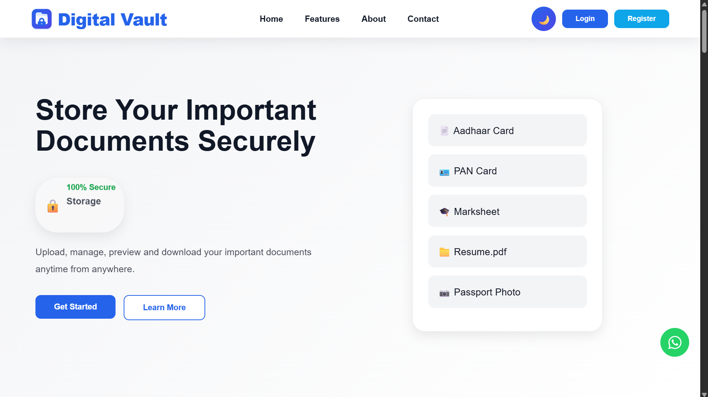
</p>

---

## 🔐 Authentication

### Create Account

<p align="center">
  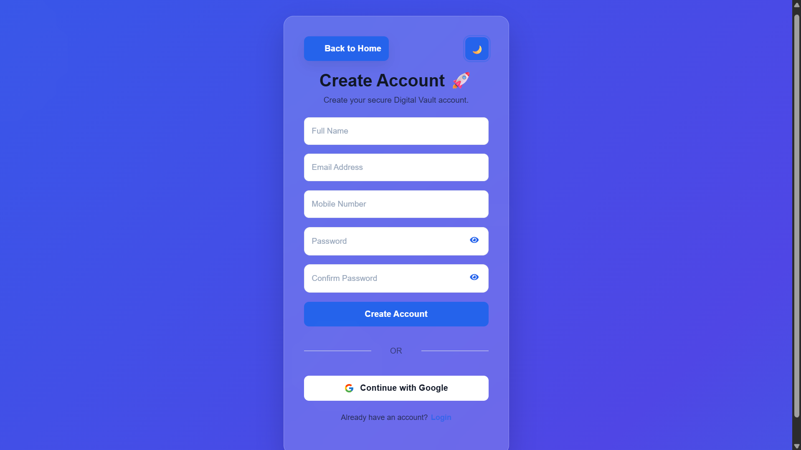
</p>

### Login

<p align="center">
  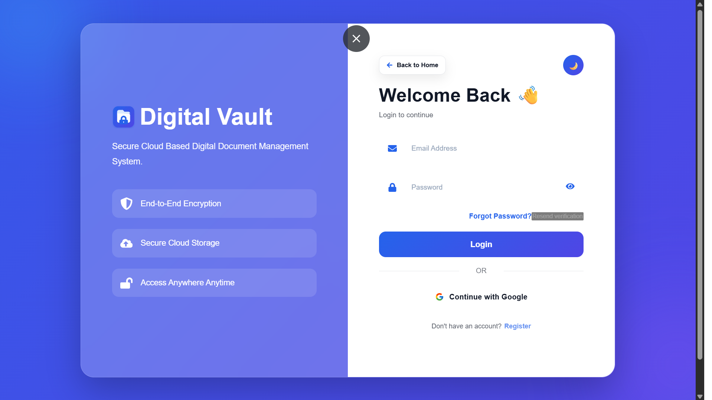
</p>

---

# 👤 User Dashboard

<p align="center">
  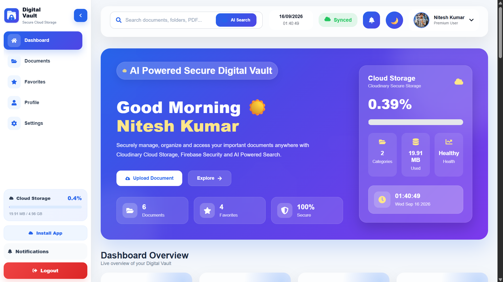
</p>

The dashboard provides a quick overview of the user's digital vault, recent documents, storage information, and important account information.

---

# 📁 My Documents

<p align="center">
  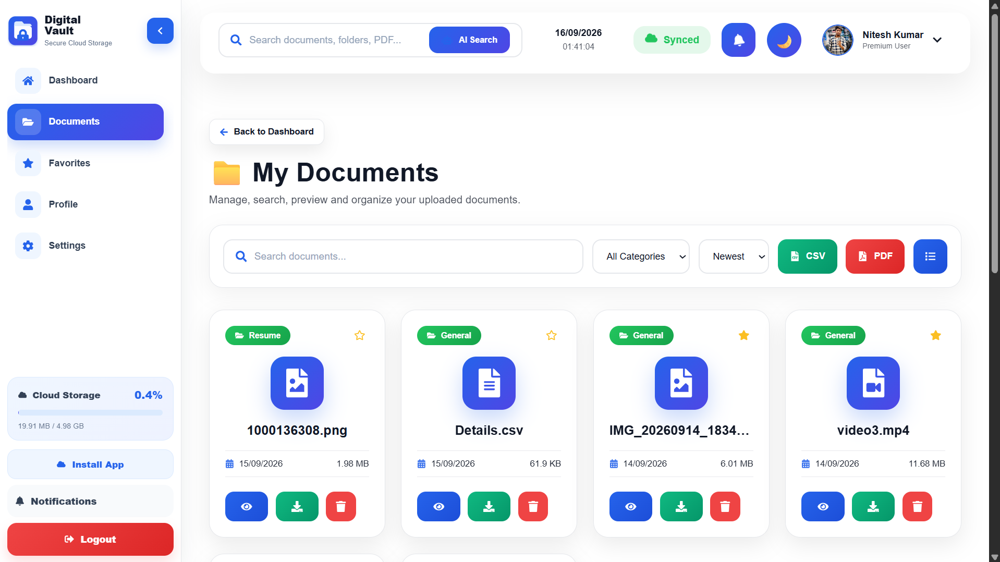
</p>

Manage uploaded documents from a centralized document workspace with file information and document actions.

---

# ⭐ Favorite Documents

<p align="center">
  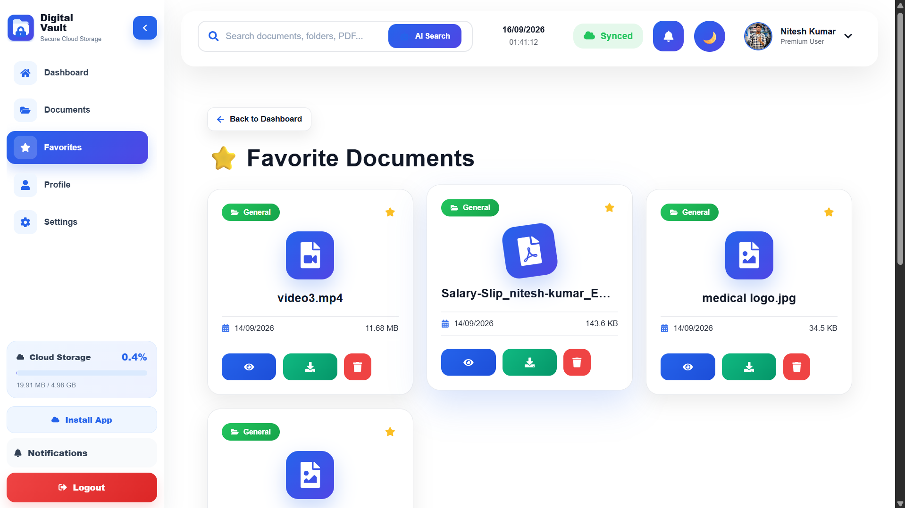
</p>

Quickly access documents marked as favorites.

---

# 👤 Profile

<p align="center">
  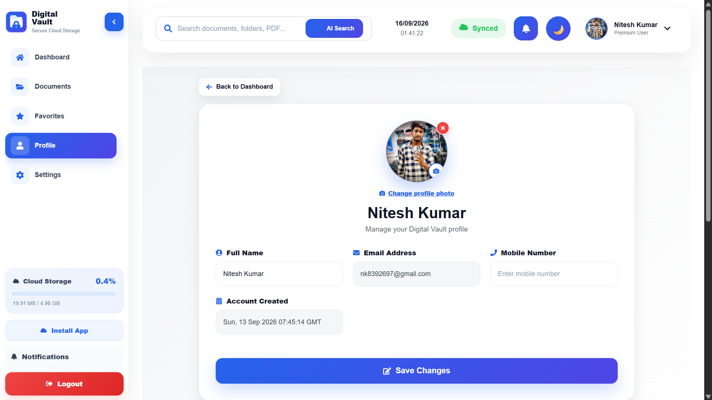
</p>

View and manage account profile information from the user profile area.

---

# ⚙️ Settings

<p align="center">
  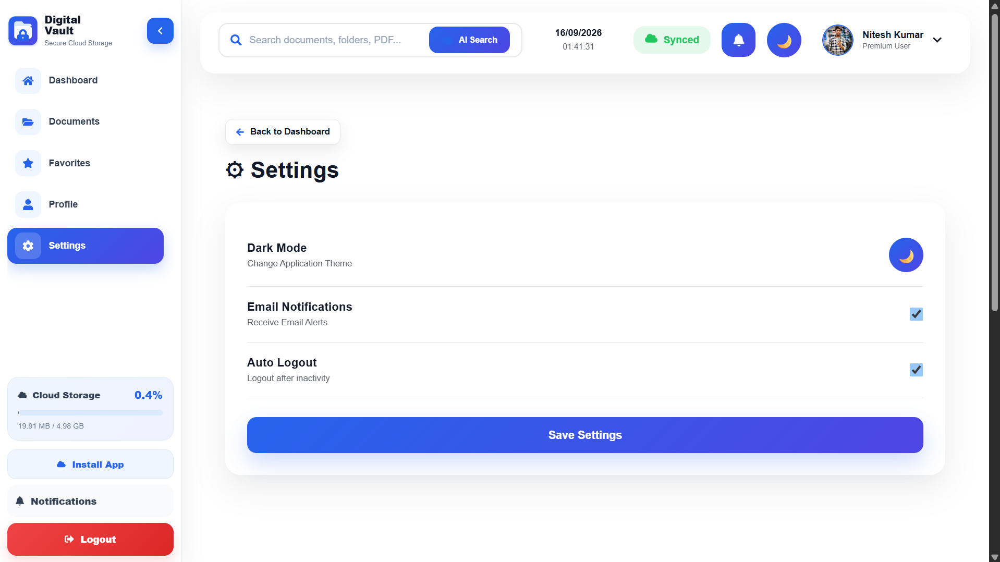
</p>

Manage available account and application preferences from the settings page.

---

# 🔔 Notifications

<p align="center">
  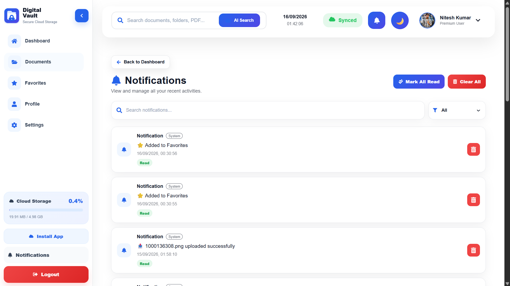
</p>

View system and account notifications in one place.

---

# 💾 Storage Details

<p align="center">
  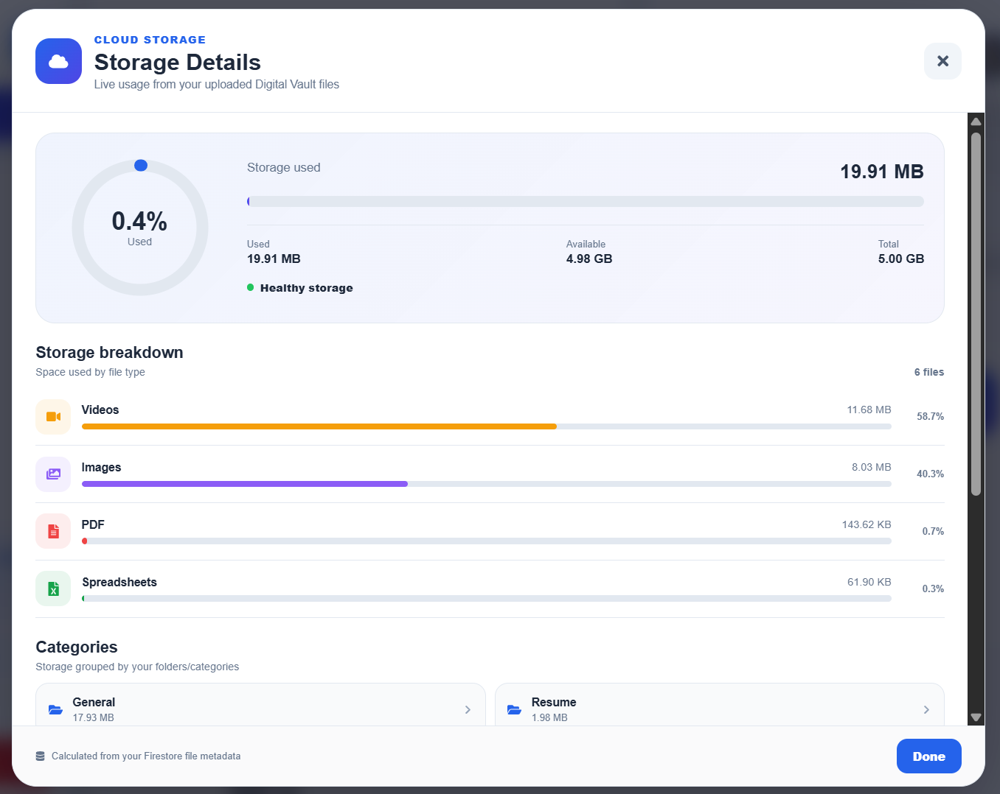
</p>

Review storage usage, file categories, and storage breakdown information.

---

# 👨‍💼 Admin Center

## 📊 Admin Dashboard

<p align="center">
  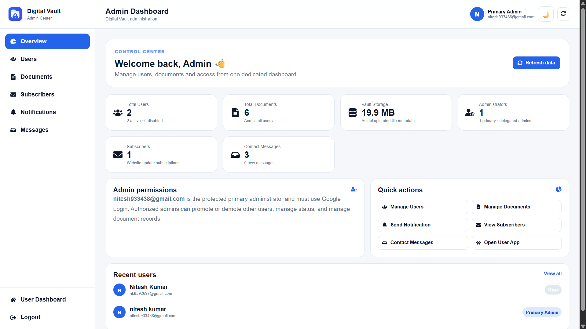
</p>

The Admin Dashboard provides administrative insights and quick access to management tools.

---

## 👥 User Management

<p align="center">
  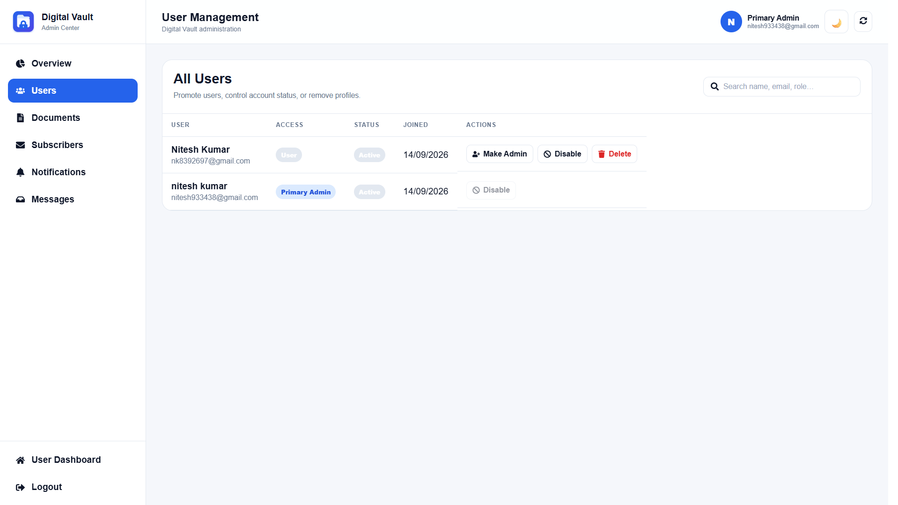
</p>

Manage registered users and review user information from the administration area.

---

## 📋 Document Management

<p align="center">
  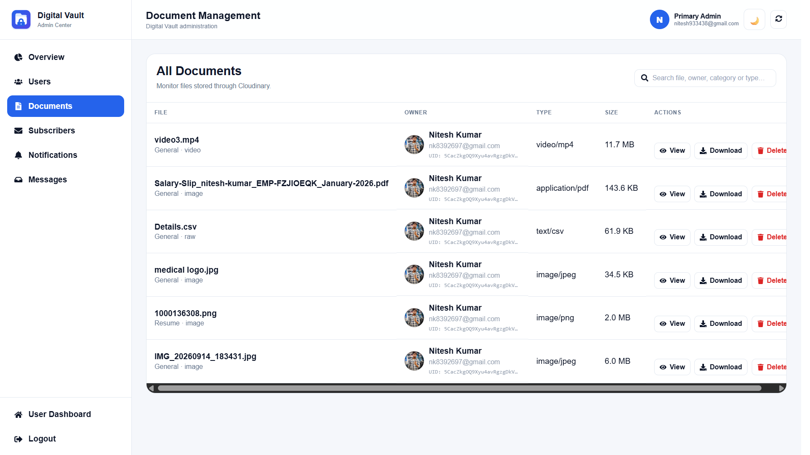
</p>

Review and manage documents across the vault from the administrator workspace.

---

## 📧 Newsletter Subscribers

<p align="center">
  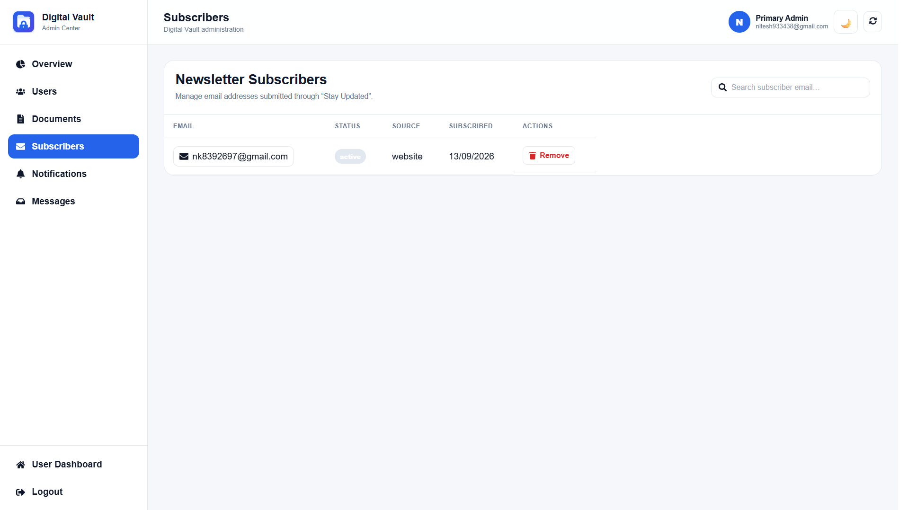
</p>

View and manage newsletter subscriber records.

---

## 🔔 Send System Notification

<p align="center">
  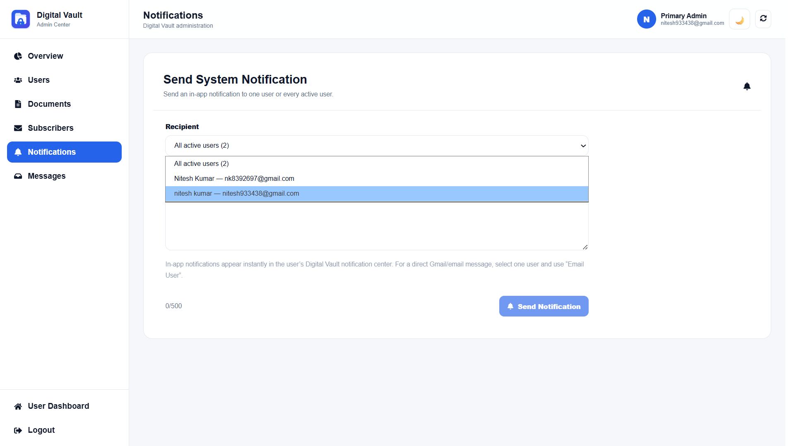
</p>

Create and send system notifications from the administration area.

---

## 📬 Contact Messages

<p align="center">
  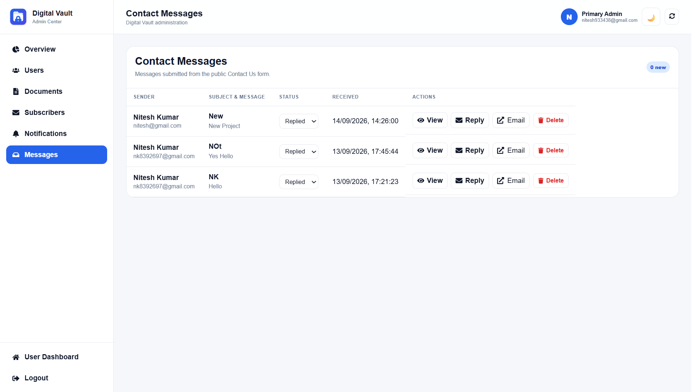
</p>

Manage contact submissions and their current status from the Admin Center.

---

# 📱 Responsive Design

Digital Vault is designed to adapt across:

- 💻 Desktop
- 🖥️ Large screens
- 📱 Mobile
- 📲 Tablets

The interface keeps navigation, cards, controls, tables, and dialogs usable across different screen sizes.

### 🔍 Touch Zoom & Pan

- Two-finger pinch gestures zoom documents and previews.
- After zooming, one-finger touch movement pans smoothly in all directions.
- Left, right, up, and down edges remain reachable on small and large screens.
- Mouse/trackpad interaction remains supported on desktop devices.
- The preview adapts to portrait and landscape orientations.

---

# 🛠️ Tech Stack

### Frontend

- React
- Vite
- JavaScript
- React Router
- Framer Motion
- React Icons
- Recharts
- React PDF
- React Dropzone

### Backend & Cloud

- Firebase Authentication
- Firebase Firestore
- Cloudinary
- Node.js
- Express

### Deployment

- GitHub Pages
- GitHub Actions

---

# 🔐 Authentication & Security

Digital Vault uses Firebase Authentication for account authentication and Firestore Security Rules for database access control.

Security practices include:

- Firebase Authentication
- Firestore Security Rules
- Protected administrative access
- User-based document ownership
- Environment-based configuration
- Sensitive credentials kept outside the frontend
- Cloudinary API secrets kept server-side where applicable
- Secrets excluded from Git

---

# ☁️ Cloud Storage

Digital Vault uses **Cloudinary** for document and file storage while Firebase/Firestore manages authentication and application metadata.

The project supports common document, image, video, archive, spreadsheet, and text formats with a configurable upload-size limit.

---

# 📊 Dashboard & Reporting

The application provides dashboard and storage insights including:

- Document statistics
- Recent documents
- Storage usage
- File categories
- Storage breakdown
- Largest files
- File counts

Administrative reporting supports document information and owner-related details through PDF and CSV report functionality.

---

# 🏗️ Project Structure

```text
Digital-Vault/
│
├── client/
│   ├── public/
│   └── src/
│       ├── components/
│       ├── pages/
│       ├── services/
│       ├── contexts/
│       └── ...
│
├── server/
├── functions/
├── firestore.rules
├── firebase.json
├── .env.example
├── FINAL-QA.md
└── README.md
```

---

# ⚙️ Local Installation

### 1. Clone the repository

```bash
git clone https://github.com/nitesh933438/Digital-Vault.git
cd Digital-Vault
```

### 2. Install client dependencies

```bash
cd client
npm install
```

### 3. Configure environment variables

Create:

```text
client/.env.local
```

and configure the Firebase and Cloudinary public configuration values required by the application.

### 4. Start the development server

```bash
npm run dev
```

Then open:

```text
http://localhost:5173
```

---

# 🔥 Firebase Setup

Configure the required Firebase services:

- Firebase Authentication
- Firebase Firestore
- Firestore Security Rules

Enable the authentication providers required by your deployment and add the appropriate development/production domains to Firebase Authentication.

---

# ☁️ Cloudinary Setup

Configure a restricted Cloudinary upload preset for browser uploads.

Keep sensitive Cloudinary API credentials out of the frontend and never commit secret credentials to Git.

---

# 🚀 Deployment

The production frontend is deployed through GitHub Pages with GitHub Actions.

**GitHub:**  
https://github.com/nitesh933438/Digital-Vault

**Live:**  
https://nitesh933438.github.io/Digital-Vault/

---

# 📌 Current Version

**v1.0.62**

---

# 📄 License

This project is created for educational, portfolio, and development purposes.

---

# 👨‍💻 Author

### Nitesh Kumar

**GitHub Profile:** [@nitesh933438](https://github.com/nitesh933438)

<p align="center">
  <strong>Digital Vault — Secure Your Digital Documents</strong>
</p>

<p align="center">
  ⭐ If you find this project useful, consider giving the repository a star.
</p>
